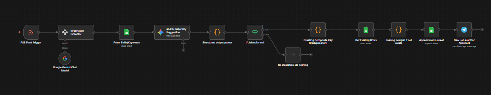

# Job Updates Automation

An AI-powered job monitoring workflow built with **n8n** to automatically collect job postings, evaluate their relevance based on predefined skills and keywords, remove duplicates, store matching roles, and send alerts for new opportunities.

This workflow is designed to reduce the manual effort of checking job boards repeatedly by continuously scanning job feeds, filtering opportunities intelligently, and notifying the applicant only when relevant roles are found.

## Overview

Searching for jobs manually every day can be repetitive, time-consuming, and inconsistent. Many opportunities are missed because they are posted across different sources and require constant monitoring.

This workflow automates the process by ingesting job listings from an RSS feed, extracting structured job information, comparing roles against skill and keyword preferences, using AI to assess suitability, removing duplicates, and notifying the user when a relevant new role appears.

## Workflow Goals

- Automate job-feed monitoring
- Extract structured information from job listings
- Match jobs against predefined skills and keywords
- Use AI to assess job suitability
- Filter out irrelevant opportunities
- Avoid duplicate job alerts
- Store and track matched roles in Google Sheets
- Send instant notifications for new relevant jobs

## Workflow Logic

The workflow follows this sequence:

1. **RSS Feed Trigger**  
   The workflow starts by monitoring an RSS feed that provides new job postings.

2. **Information Extraction**  
   Job details are extracted from the feed content for further analysis.

3. **AI-Assisted Parsing**  
   A Google Gemini model is used to help interpret and structure job-related information.

4. **Skills / Keywords Reference**  
   The workflow fetches a skills-and-keywords list from Google Sheets to use as the matching baseline.

5. **AI Job Suitability Suggestion**  
   AI evaluates the job posting against the defined profile and suggests whether the role is suitable.

6. **Structured Output Parsing**  
   The response is converted into a structured format for consistent downstream processing.

7. **Relevance Filtering**  
   A decision step checks whether the job is a strong enough fit to move forward.

8. **Deduplication Logic**  
   A composite key is created to identify duplicate job postings and avoid repeated alerts.

9. **Existing Record Check**  
   The workflow checks existing rows in Google Sheets to see whether the job has already been stored.

10. **Duplicate Prevention**  
    If the job already exists, the workflow stops further action for that item.

11. **Append New Job Record**  
    If the job is new and relevant, it is appended to a Google Sheet for tracking.

12. **Telegram Notification**  
    A Telegram alert is sent so the applicant receives the new job opportunity immediately.

## Key Features

- RSS-based automated job tracking
- AI-assisted job relevance analysis
- Skill and keyword matching
- Structured parsing of job information
- Deduplication using composite key logic
- Google Sheets-based tracking system
- Telegram notifications for new matches
- Reduced manual job search effort

## Workflow Architecture

## Files

- `workflow.json` — exported n8n workflow
- `architecture.png` — workflow architecture screenshot
- `README.md` — project documentation

## Tech Stack

This workflow may involve tools and services such as:

- **n8n**
- **RSS Feed Trigger**
- **Google Gemini**
- **Google Sheets**
- **Telegram**
- **Conditional logic nodes**
- **Structured parsing / transformation steps**

## Use Case

This project is useful for job seekers who want to automate opportunity discovery based on their own skillset, preferred keywords, and role fit. It helps build a personalized job alert system that is more targeted than generic job-board notifications.

## Outcome

The workflow demonstrates how AI and automation can be used together to create a personal job intelligence system. Instead of manually checking platforms and filtering irrelevant listings, the workflow continuously tracks opportunities, scores relevance, prevents duplicates, and sends only meaningful alerts.

## Note

This shared version is intended for portfolio and demonstration purposes only.

- Sensitive credentials and private details have been removed
- Shared workflow exports are sanitized before publishing
- The workflow can be extended further with resume matching, application tracking, ranking logic, and multi-source job aggregation
