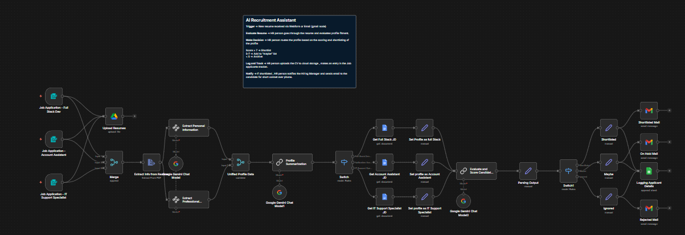

# AI HR Recruitment Assistant

An AI-powered recruitment workflow built with **n8n** to automate candidate intake, resume analysis, profile extraction, role-wise evaluation, and applicant shortlisting.

This workflow is designed to reduce manual screening effort by analyzing incoming job applications, extracting structured candidate information, matching applicants against role requirements, and routing them into decision buckets such as shortlisted, on-hold, maybe, ignored, or rejected.

## Overview

Recruitment teams often spend a large amount of time manually reviewing resumes, checking role-fit, and deciding which applicants should move forward. This workflow automates that early-stage screening process using AI and structured workflow logic.

The system processes job applications for multiple roles, extracts important candidate details from resumes, evaluates candidates against role-specific expectations, and performs decision-based routing for recruiter follow-up.

## Workflow Goals

- Automate resume intake and parsing
- Extract personal and professional candidate details
- Build a structured candidate profile
- Classify applicants by job role
- Evaluate and score candidates against job requirements
- Reduce recruiter effort in first-level screening
- Route candidates into actionable decision categories

## Workflow Logic

The workflow follows a staged recruitment pipeline:

1. **Job Application Intake**  
   Candidate applications are received for multiple job roles such as:
   - Full Stack Developer
   - Account Assistant
   - IT Support Specialist

2. **Resume Upload / Collection**  
   Resume files are uploaded and collected for further analysis.

3. **Resume Data Extraction**  
   AI is used to extract information from the uploaded resume and convert unstructured content into usable data.

4. **Candidate Information Structuring**  
   The workflow separates candidate information into:
   - Personal information
   - Professional information

5. **Unified Candidate Profile Creation**  
   Extracted details are merged into a single profile object for downstream evaluation.

6. **AI-Based Profile Interpretation**  
   The workflow uses AI to interpret the candidate’s background and prepare the profile for role-based assessment.

7. **Role-Based Branching**  
   A switch node routes the candidate into the appropriate evaluation path depending on the applied role.

8. **Role-Specific Profile Setup**  
   Role-specific context is prepared for:
   - Full Stack Developer
   - Account Assistant
   - IT Support Specialist

9. **Candidate Evaluation and Scoring**  
   AI is used again to evaluate and score the candidate against the selected role criteria.

10. **Decision Routing**  
    Based on evaluation output, the candidate is routed into one of the following categories:
    - Shortlisted
    - On Hold
    - Maybe
    - Ignored
    - Rejected

11. **Action Layer**  
    Final actions include:
    - Sending recruiter emails
    - Logging applicant data
    - Updating records for future follow-up

## Key Features

- Multi-role recruitment workflow
- Resume parsing and structured information extraction
- AI-assisted candidate profiling
- Role-wise screening logic
- Candidate scoring and classification
- Automated recruiter decision support
- Email and logging integration for final actions

## Workflow Architecture

## Files

- `workflow.json` — exported n8n workflow
- `architecture.png` — workflow architecture screenshot
- `README.md` — project documentation

## Tech Stack

This workflow may involve tools and services such as:

- **n8n**
- **Google Gemini / LLM-based analysis**
- **Google Drive or file storage**
- **Email integration**
- **Conditional routing / switch logic**
- **Structured data transformation nodes**

## Use Case

This project is useful for automating the first layer of HR screening in organizations that receive frequent job applications and need faster shortlisting support. It helps standardize candidate evaluation and reduces repetitive recruiter workload.

## Outcome

The workflow demonstrates how AI can be integrated with business process automation to improve hiring operations. Instead of manually reading each resume and deciding the next action, recruiters can use this system to receive pre-processed, role-aware, and decision-ready candidate insights.

## Note

This shared project version is intended for portfolio and demonstration purposes only.

- Sensitive credentials and private details have been removed
- Shared workflow exports are sanitized before publishing
- The workflow can be extended further with ATS integration, scoring dashboards, and recruiter review interfaces
