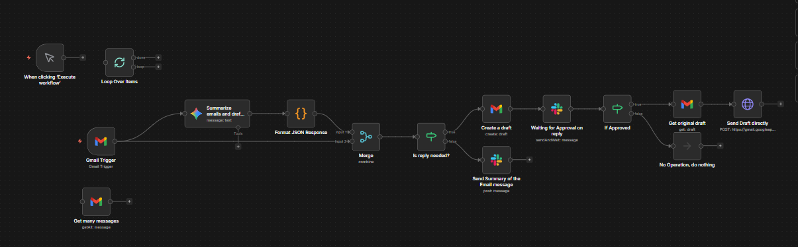

# AI Powered Email Assistant

An AI-powered email automation workflow built with **n8n** to help process incoming emails, generate summaries, decide whether a response is needed, draft replies, and route them for approval before sending.

This workflow is designed to reduce the time spent managing emails by combining AI-based understanding, automated draft generation, and human approval in the loop.

## Overview

Handling email manually can become repetitive and time-consuming, especially when there are many incoming messages that need quick understanding, prioritization, and response drafting.

This workflow automates that process by reading incoming Gmail messages, summarizing them, deciding if a reply is required, generating a structured response, and sending the draft for approval before it is delivered.

## Workflow Goals

- Monitor incoming emails automatically
- Summarize email content with AI
- Determine whether a reply is needed
- Generate response-ready draft content
- Keep a human approval step before sending
- Reduce repetitive email handling effort
- Improve speed and consistency in email communication

## Workflow Logic

The workflow follows this sequence:

1. **Email Intake**  
   Incoming emails are detected using a Gmail trigger.

2. **Message Collection**  
   Email content is retrieved for processing and analysis.

3. **AI Summarization and Draft Support**  
   AI analyzes the email and helps summarize the message while also preparing draft-ready response content.

4. **Structured Output Formatting**  
   The AI output is converted into a structured JSON-style format so it can be used reliably in later workflow steps.

5. **Decision: Is a Reply Needed?**  
   The workflow checks whether the message requires a reply.

6. **Branching Logic**
   - If no reply is needed, the workflow sends a summary message only.
   - If a reply is needed, the workflow continues to draft creation.

7. **Draft Creation**  
   A Gmail draft is created automatically.

8. **Approval Workflow**  
   The draft is sent to Slack for review and approval.

9. **Approval Check**
   - If approved, the original draft is fetched and sent.
   - If not approved, no further sending action is taken.

10. **Final Delivery**  
    The approved draft is sent through the email sending step.

## Key Features

- Gmail-triggered email automation
- AI-powered email summarization
- Reply-needed detection logic
- Structured JSON output formatting
- Automatic draft generation
- Slack-based approval workflow
- Human-in-the-loop email sending
- Faster and more consistent email handling

## Workflow Architecture

## Files

- `workflow.json` — exported n8n workflow
- `architecture.jpg` — workflow architecture screenshot
- `README.md` — project documentation

## Tech Stack

This workflow may involve tools and services such as:

- **n8n**
- **Gmail**
- **Slack**
- **LLM / AI model for summarization and drafting**
- **Conditional logic nodes**
- **Structured formatting / JSON transformation**

## Use Case

This project is useful for anyone who handles repetitive email communication and wants a system that can assist with understanding, drafting, and approval before sending. It is especially valuable in business support, operations, client communication, and internal coordination workflows.

## Outcome

The workflow demonstrates how AI can be used as an email co-pilot inside an automation system. Instead of manually reading every email, deciding whether to reply, drafting the message, and requesting review, the workflow handles most of the repetitive effort while keeping final control with a human approver.

## Note

This shared version is intended for portfolio and demonstration purposes only.

- Sensitive credentials and account-specific information have been removed
- Shared workflow exports are sanitized before publishing
- The workflow can be extended further with auto-labeling, priority classification, CRM integration, and email analytics
