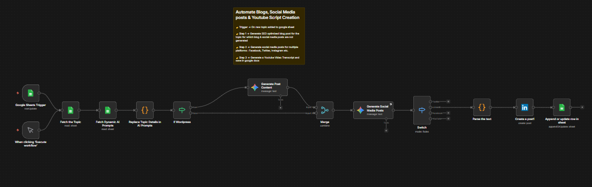

# Automated Content Creation Workflow

An AI-powered content automation workflow built with **n8n** to generate blogs, social media content, and platform-ready post assets from a topic list managed in Google Sheets.

This workflow is designed to streamline content production by taking structured topic inputs, applying dynamic AI prompts, generating long-form and short-form content, and publishing or logging the final outputs through connected platforms.

## Overview

Creating content consistently for blogs and social media takes significant manual effort, especially when the same topic needs to be adapted into multiple formats.

This workflow automates that process by taking a topic from Google Sheets, combining it with dynamic prompts, generating content with AI, preparing social media variations, and publishing or recording the results automatically.

## Workflow Goals

- Automate topic-based content generation
- Use dynamic prompts for flexible AI content creation
- Generate blog-style and social-media-ready outputs
- Reduce repetitive manual writing effort
- Maintain a content pipeline from sheet to publishing
- Track generated outputs back in Google Sheets
- Create a reusable content production system

## Workflow Logic

The workflow follows this sequence:

1. **Topic Trigger**  
   The automation begins from a Google Sheets trigger, where new or updated rows act as the source of content topics.

2. **Fetch Topic Data**  
   The selected topic is retrieved from the sheet.

3. **Fetch Dynamic AI Prompts**  
   Prompt templates are pulled dynamically so the workflow can generate different content formats based on reusable instructions.

4. **Replace Topic Placeholders in Prompts**  
   The workflow injects the selected topic into the prompt templates before sending them for generation.

5. **WordPress / Blog Handling Step**  
   A logic step checks or prepares blog-related content flow before generation proceeds.

6. **Generate Main Post Content**  
   AI creates the main post content based on the selected topic and prompt structure.

7. **Merge Content Paths**  
   Generated outputs are combined so they can be used downstream for additional transformations and publishing actions.

8. **Generate Social Media Posts**  
   AI creates short-form content variants intended for social platforms.

9. **Switch / Routing Logic**  
   The workflow routes content based on rules for the intended output or platform type.

10. **Parse the Generated Text**  
    The generated response is parsed and cleaned into a publishable or platform-ready format.

11. **Create a Post**  
    The workflow creates a social media post, such as a LinkedIn post.

12. **Update Tracking Sheet**  
    The final output is appended or updated in Google Sheets so content production stays tracked and organized.

## Key Features

- Google Sheets-driven topic pipeline
- Dynamic AI prompt usage
- Automated blog and social content generation
- Multi-format content adaptation
- LinkedIn publishing support
- Structured parsing and formatting
- Sheet-based tracking and update logging
- Reusable content workflow design

## Workflow Architecture

## Files

- `workflow.json` — exported n8n workflow
- `architecture.png` — workflow architecture screenshot
- `README.md` — project documentation

## Tech Stack

This workflow may involve tools and services such as:

- **n8n**
- **Google Sheets**
- **AI / LLM-based text generation**
- **WordPress-related publishing or logic**
- **LinkedIn integration**
- **Text parsing and transformation nodes**
- **Conditional routing / switch logic**

## Use Case

This project is useful for creators, marketers, solopreneurs, and teams who want to automate content production across multiple formats from a central list of topics. It can support blog creation, social media publishing, and content pipeline management with minimal manual intervention.

## Outcome

The workflow demonstrates how AI and automation can be combined to build a repeatable content engine. Instead of manually brainstorming, drafting, adapting, and publishing content for each platform, the workflow helps generate and distribute content in a more scalable and structured way.

## Note

This shared version is intended for portfolio and demonstration purposes only.

- Sensitive credentials and account-specific details have been removed
- Shared workflow exports are sanitized before publishing
- The workflow can be extended further with approval flows, multi-platform publishing, SEO metadata generation, image generation, and analytics tracking
