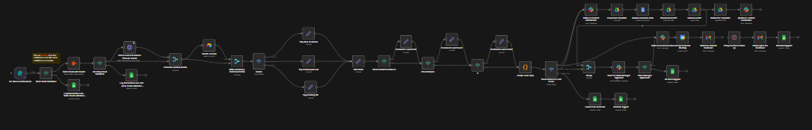

# Lead Processing Workflow

An AI-assisted lead processing and enrichment workflow built with **n8n** to automate lead intake, data cleaning, enrichment, qualification, routing, and downstream follow-up actions.

This workflow is designed to reduce manual work in handling inbound lead data by transforming raw lead information into structured, enriched, and actionable records that can be stored, routed, or acted upon automatically.

## Overview

Lead management often becomes inefficient when raw lead data arrives from multiple sources and requires manual cleaning, verification, qualification, enrichment, and follow-up.

This workflow automates the lead processing pipeline by taking incoming lead information, validating and transforming it, enriching the record with additional context, applying decision logic, and routing the result to the next business systems or action layers.

## Workflow Goals

- Automate lead intake and structuring
- Clean and normalize raw lead data
- Enrich lead records with additional information
- Apply qualification or routing logic
- Reduce repetitive manual processing effort
- Improve lead organization and response readiness
- Support downstream sales or operations workflows

## Workflow Logic

The workflow follows a multi-stage lead processing pipeline:

1. **Lead Intake**  
   Lead data enters the system through a trigger or connected input source.

2. **Initial Data Preparation**  
   The raw input is cleaned, mapped, and prepared for processing.

3. **Validation and Structuring**  
   Important lead fields are checked and transformed into a more structured format.

4. **Lead Enrichment Steps**  
   Additional processing is applied to improve the value of the lead record, such as extracting or augmenting relevant details.

5. **Branching and Conditional Handling**  
   The workflow uses decision points to handle leads differently depending on completeness, quality, category, or business rules.

6. **Multi-Step Processing Pipeline**  
   Leads move through a series of processing and transformation stages that prepare them for qualification and downstream actions.

7. **Aggregation / Combination Layer**  
   Intermediate outputs are combined so the workflow can make more informed routing or enrichment decisions.

8. **Qualification or Action Decision**  
   The workflow applies logic to decide how the processed lead should be handled next.

9. **Downstream System Actions**  
   Based on the result, the workflow can create records, update systems, notify teams, send messages, or log outputs into connected tools.

10. **Tracking and Record Updates**  
    Final lead outcomes are stored or updated so that processed data remains organized and usable for follow-up.

## Key Features

- Automated lead intake workflow
- Data cleaning and normalization
- Lead enrichment pipeline
- Multi-step transformation logic
- Conditional routing and decision-making
- Integration-ready downstream actions
- Structured lead tracking and updates
- Scalable workflow design for sales and operations

## Workflow Architecture

## Files

- `workflow.json` — exported n8n workflow
- `architecture.png` — workflow architecture screenshot
- `README.md` — project documentation

## Tech Stack

This workflow may involve tools and services such as:

- **n8n**
- **AI / LLM-assisted processing**
- **Spreadsheet or database integrations**
- **Email / notification tools**
- **Data transformation nodes**
- **Conditional logic and branching**
- **External enrichment or business APIs**

## Use Case

This project is useful for businesses or teams that receive lead data from forms, campaigns, inbound channels, or outreach systems and want a repeatable way to process leads before they move into sales or support workflows.

It can help ensure that leads are cleaner, more complete, and easier to prioritize before human follow-up begins.

## Outcome

The workflow demonstrates how automation can improve lead operations by turning scattered or incomplete inbound data into structured and decision-ready records. Instead of manually validating, enriching, and routing each lead, the workflow handles these repetitive processing stages automatically and supports faster downstream execution.

## Note

This shared version is intended for portfolio and demonstration purposes only.

- Sensitive credentials and account-specific details have been removed
- Shared workflow exports are sanitized before publishing
- The workflow can be extended further with CRM syncing, lead scoring, deduplication, sales assignment logic, and analytics dashboards
